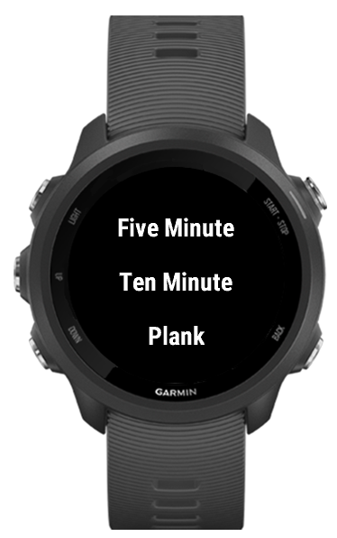

#  AbsTimer for Garmin Smartwatches
By [kaedenbrinkman](https://github.com/kaedenbrinkman)

## Instructions
-	Usage varies by watch model. On Forerunner 245, press START as if you were going to start an activity. There should be a new activity option called “AbsTimer.” Select it.
-	The app will automatically start Five Minute Abs (fabs). It displays the current activity, along with the number of seconds until it is time to switch. After each activity is done, the watch will sound a tone and/or vibrate (depending on watch hardware). When it reaches the end, the display will read “Complete!”
-	Press and hold one of your physical buttons to change what type of abs you are doing. On the Forerunner 245, press and hold the UP button. On Venu, press and hold the back button. You can now select either Ten Minute Abs or Plank Abs as well. If you select the abs that you were already doing, nothing will happen. If you select a new type of abs, the timer will reset. AbsTimer should remember what abs you did last and display that automatically when you open the application in the future.

## Installation
1.	Connect your device to a computer via USB
2.	Download the AbsTimer.prg file from the folder that corresponds to your device type
3.	Copy the AbsTimer.prg file into /GARMIN/APPS/
4.	Eject the device, then unplug it.

If you don’t see your device type, let me know. It shouldn’t be too hard to build a new file for another device.
Also, if there are any bugs or changes that you would like to report or suggest, let me know as well.

All of the code is available in the Code folder. The app does not have access to location, movement, or bluetooth data.
If you would like to remove the app from your device, just delete it from where you copied it to.

  
